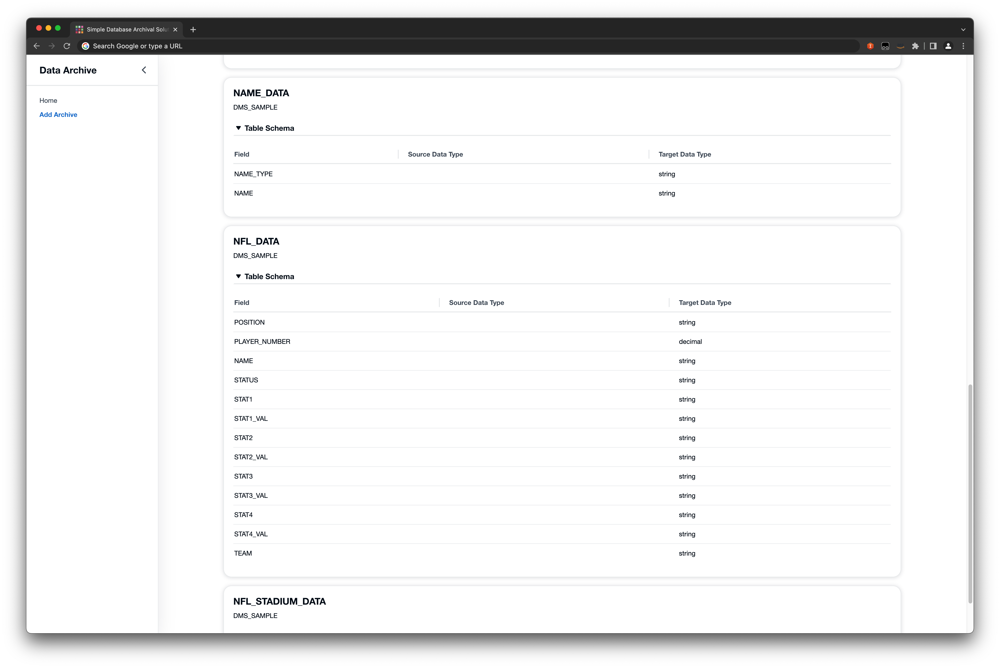
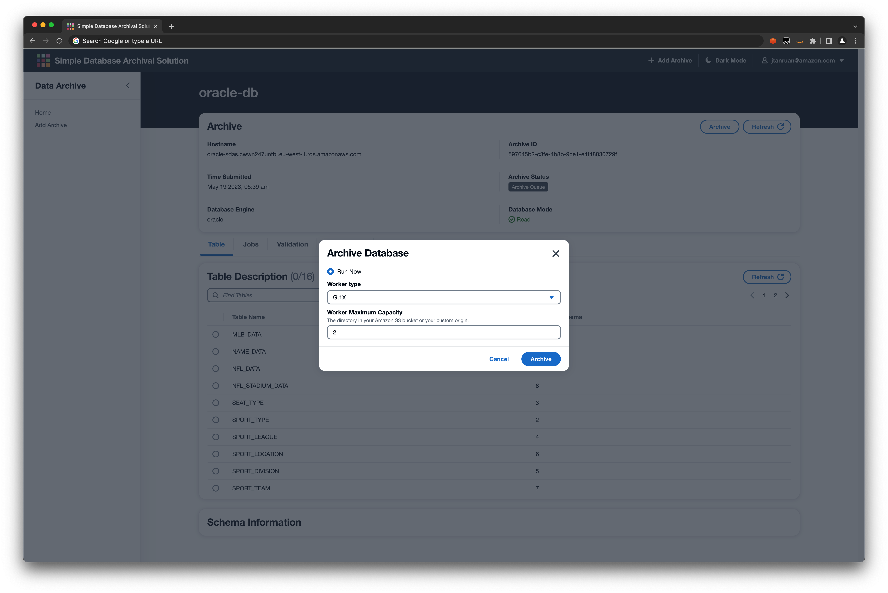
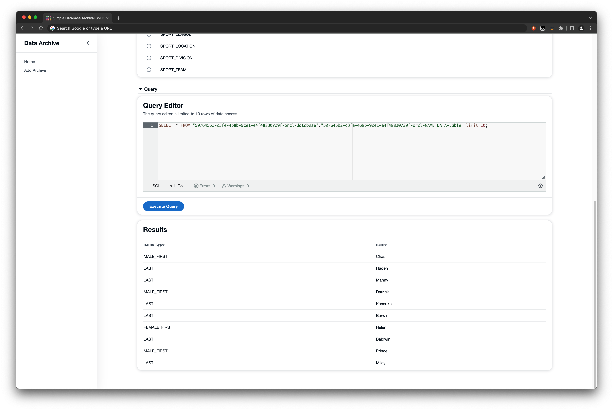
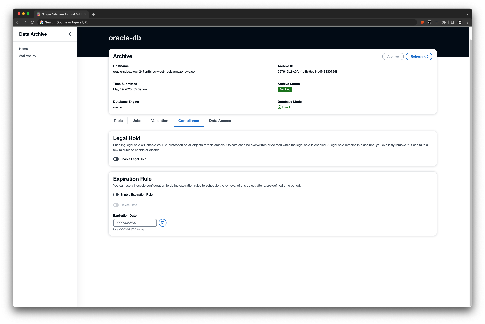

# Simple Database Archiving System

 
## Introduction

Simple Database Archiving System (SDAS) is an open source solution, which you can deploy in your AWS account to archive data to AWS. SDAS will connect to your database which can be on premises or in the cloud, map the schema, perform validation, and finally transfer data to AWS for storage in Amazon S3. This is accomplished by primarily leveraging AWS Step Functions and AWS Glue. The main purpose of SDAS is to provide an out-of-the-box solution that easily allows customers to archive data in the cloud coming from on premises or cloud-hosted databases.

## What is Simple Database Archival Solution (SDAS)?

As businesses accumulate more and more data over time, the need for effective database archiving solutions has become increasingly important, for example moving older, rarely used data to an archive. Businesses can reduce the size of their active databases, which can improve performance and reduce storage costs. Archiving also helps organizations meet legal and regulatory requirements for data retention, as well as ensure that important data is available for future use and discovery, if necessary. Out of the box, SDAS provides the following key features:

* Support for Oracle, MySQL or Microsoft SQL Server
* Identify the data type and table schema 
* Validate the data on the target after the archiving process has completed
* Ability to configure WORM (“Write Once Read Many”) 
* Ability to defined data retention period for the data
* Detailed information about the status of the data
* Perform various data validation and integrity checks
* Make it simple for operation to ingest and archive database
* Ability to preview data archived in Amazon S3

## Architecture


## Tool Versions

To build and deploy SDAS the following tools are required.

1. NodeJs >= 16
2. Python3 >= 3.9
3. Docker


## 1. Build 

The top level package.json is only for easy to use top level commands and doesn't contain any packages so there is no reason to install it.  When pulling latest its always best to run a build all to ensure you have the latest code. 

To build the entire project run:

```bash
# Execute this command from the root of the cloned repository.
npm run build
```

Then during development, individual parts of the project can be built separately using the scoped commands:

```bash
# Execute this command from the root of the cloned repository.
npm run build.cdk
npm run build.web
```

## 2. Deploy

If you are deploying to a new account or region you will need to bootstrap the CDK.  By default CDK bootstraps with AdministratorAccess policy which is restricted in certain environments.  If you need greater access than PowerUserAccess and IAMFullAccess, add the role arns to the list.

If you are installing the application into a region other than `us-east-1` you must bootstrap both regions.  You can do this by setting the environment variable `CDK_DEPLOY_REGION` to us-east-1 and running the command below, then clearing the environment variable to pick up the set default.  Or you can manually run the command with both regions provided.  See statements below.

```bash
# Execute this command from the root of the cloned repository.
npm run deploy.bootstrap
```

### Deployment

To deploy run the following command.

```bash
# Please substitute ${YOUR_ADMINISTRATOR_EMAIL} with the email 
# address of your administrator. An email containing your password 
# for signing in will be sent to that address.
# Execute this command from the root of the cloned repository.
# It will take approximately 106 mins for the stack to be deployed.
npm run deploy -- -c admin_email="${YOUR_ADMINISTRATOR_EMAIL}"
```

### Access the Front-end

 1. Check your `email` for your temporary password
 1. Check the Cloudformation sdas stack outputs value of WebAppCloudFrontDistributionDomainNameXYXY
 1. Open your web browser, enter the web address obtained in step 2, and login as `admin` and the temporary password provided via email

## Developer Setup

1. Add example.com to your hosts file.  This is needed to support CORS restrictions for authenticated requests during development.

On mac/linux, edit /etc/hosts and add the following line:

```
127.0.0.1       example.com
```

2. Set the api gateway url for the shared development environment

After deployment of the shared development environment, edit the `.env.development` file and update the `REACT_APP_API_URL` environment variable to the ApiGatewayUrl.  This only needs to be done once.  

## Using SDAS

### 1. Start and Discover
To start the archiving process, gather essential connection information, including the database name, database URI, and credentials. With this information, SDAS attempts to connect to the database, and if successful, proceeds to the next step. In the next step, SDAS collects the tables and associated schema from the target database to be archived.


To identify the data that needs to be archived, SDAS uses a technique to scan the metadata associated with the table. This process is designed to accurately identify the data type and schema of the table and ensure that the data is properly formatted and validated before being transferred to AWS. The process involves running multiple SQL queries to extract the database schema definition to allow AWS Glue to read and finally write the data to Amazon S3.

Once the data type and schema of the table have been identified, SDAS can begin the process of transferring the data to AWS.



### 2. Archive
The archive phase of SDAS is a critical step in the process of archiving data to Amazon S3. SDAS is designed to automatically archive data from Oracle, Microsoft SQL, and MySQL databases, providing flexibility and versatility for customers. The archiving process can be triggered either manually or automatically based on a defined schedule, enabling customers to customize the solution to their specific needs.



At the core of the archive phase is AWS Glue, a fully managed Extract, Transform, and Load (ETL) service that provides a flexible and scalable solution for copying the database from the source to the target. SDAS leverages the power of AWS Glue to perform necessary transformations on the data, including data cleaning and schema transformations, ensuring that the data is properly formatted and validated before being transferred to Amazon S3.

Once the data is transferred to Amazon S3, it is stored as Parquet files, a columnar storage format that is optimized for query performance and storage efficiency. This makes the archived data easy to query, for instance using Amazon Athena, a serverless query service that allows customers to query data stored in S3 using SQL. By leveraging the power of Amazon Athena, customers can easily perform ad-hoc analysis on their archived data without the need for complex setup or maintenance.

### 3. Data Validation
The data validation phase of SDAS is a critical step that ensures the accuracy and completeness of the archived data. After the archival process is complete, SDAS automatically triggers a validation process to ensure that the data has been properly transferred and stored in Amazon S3.

The validation process begins by comparing the source data to the archived data stored in Amazon S3, using a variety of techniques such as checksums, and data sampling. This process ensures that the data has been accurately transferred and stored, with no data loss or corruption. SDAS does not perform validation on the source data, only on the data stored in Amazon S3.

If any discrepancies are detected, SDAS provides you with the ability to identify the affected table. In addition to ensuring the accuracy of the archived data, SDAS also provides security features to protect against unauthorized access or modification of the data. Passwords are stored in AWS Secrets Manager, which provides a highly secure mechanism for storing and managing secrets, such as database passwords.


### 4. Access to Archived Databases
Access to the archived databases in SDAS is limited to authorized users who can access them through the Amazon Athena Console. To explore and visualize the data using Business Intelligence tools, users can download, install, and configure either an ODBC (Open Database Connectivity) or JDBC (Java Database Connectivity) driver to connect to Amazon Athena. 

SDAS also includes a preview mode through the console, which allows users to quickly view the database that has been archived without the need for additional drivers or tools. This preview mode provides users with a quick and easy way to assess the quality and completeness of the archived data before proceeding with further analysis or querying. 



### 5. Object Lock
SDAS includes a powerful feature that enables users to enable Amazon S3 Object Lock, a feature that allows objects to be stored using a WORM (Write Once, Read Many) model. This feature is designed for use in scenarios where it is critical that data is not modified or deleted after it has been written.

By enabling Amazon S3 Object Lock, users can ensure that their archived data is fully protected from accidental or malicious deletion or modification. This feature provides a powerful layer of security that helps to prevent data loss or corruption, ensuring that the archived data remains complete and accurate for future analysis and querying.



## Destroy

To destroy the dev environment, run:

```bash 
# From the deploy directory
# Replace ${BRANCH_NAME} with your branch name, for example:
# cdk destroy main
cdk destroy ${BRANCH_NAME}
```

## Development

The top level project structure follows a responsibility structure:

- `/api` - contains lambda functions for the api
- `/deploy` - contains cloud development kit (CDK) to deploy the solution
- `/web-app` - contains the SPA web client for the application
- `/functions` - contains the lambda functions not associated with APIs
- `/step-functions` - contains the lambda functions for AWS Step Functions

## Troubleshooting

### Docker issues

### Build fails during a docker step due to `OSError: [Errno 28] No space left on device:` or something similar.

Open docker desktop, click on `Images`, click on `Clean up`, check `Unused` and `Dangling`, then click `Remove`.   

or run from the command line: `docker image prune -a`

## License

See the [LICENSE](./LICENSE) file for our project's licensing.

Copyright Amazon.com, Inc. or its affiliates. All Rights Reserved.

Unless required by applicable law or agreed to in writing, software distributed under the License is distributed on an "AS IS" BASIS, WITHOUT WARRANTIES OR CONDITIONS OF ANY KIND, either express or implied.
